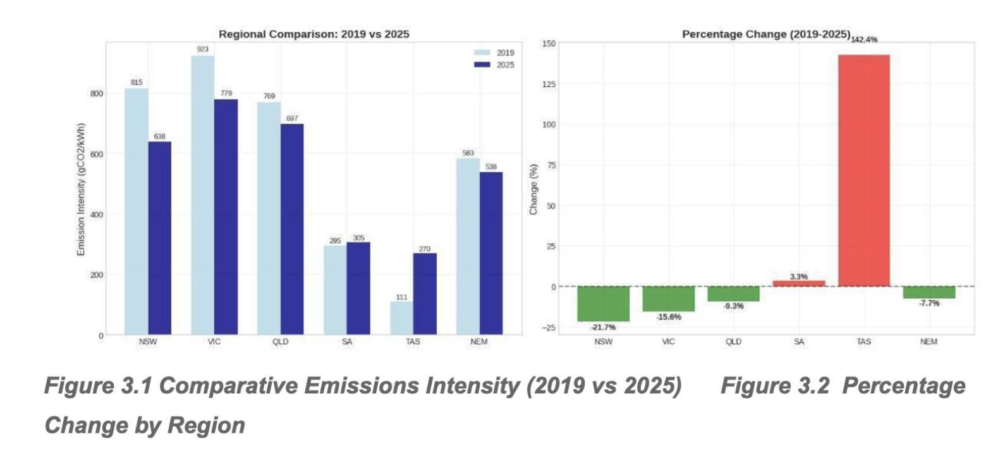
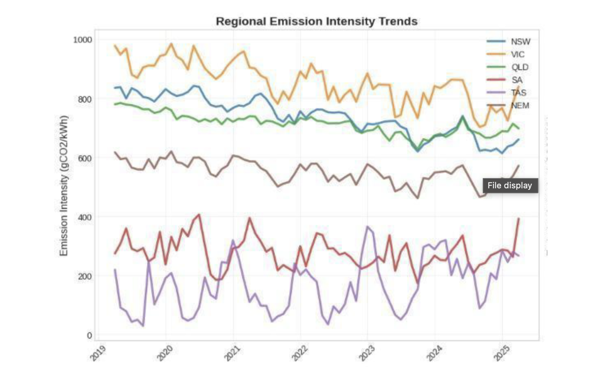
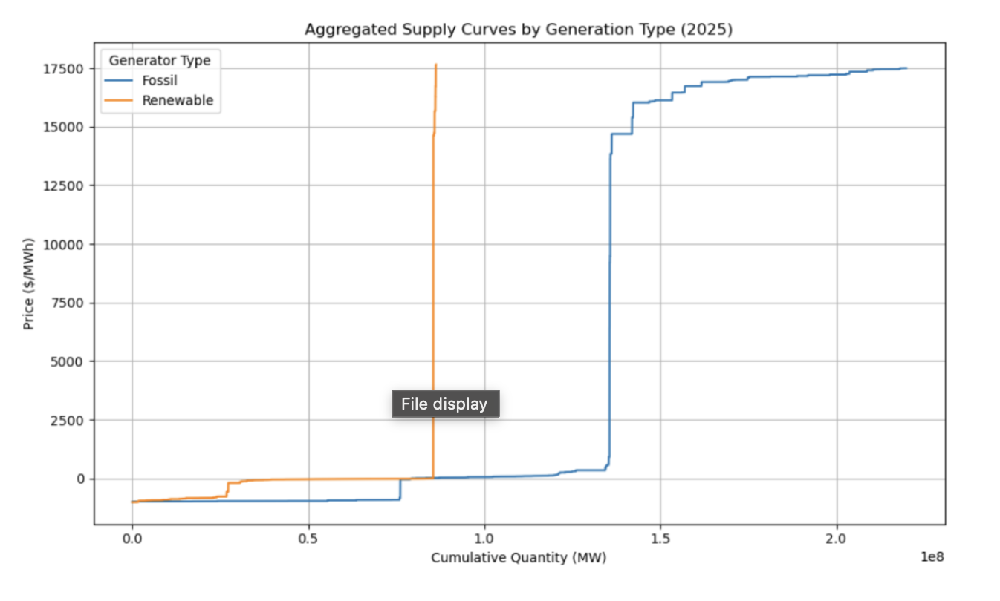
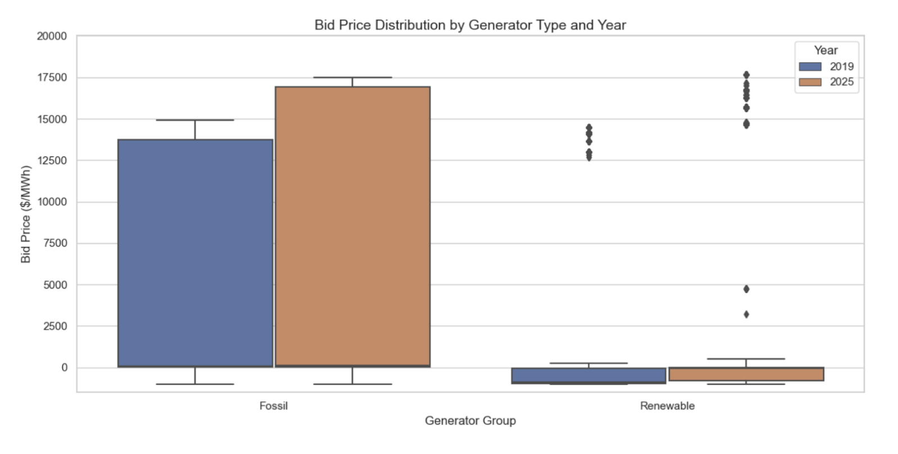
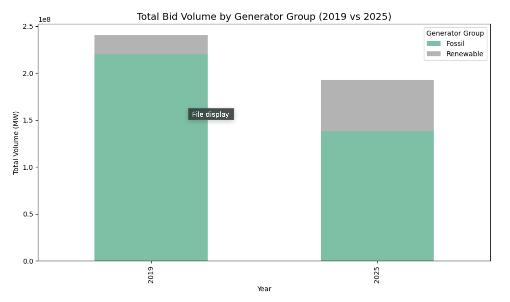

# NEM Emissions & Bidding Analysis

Analysis of Australian National Electricity Market (NEM) emissions intensity and generator bidding behaviour using Python, covering 5-minute interval dispatch and emissions data across NEM regions.

## Overview

This project analyses carbon emissions intensity and generator bidding behaviour in the Australian National Electricity Market (NEM) using Python.

Using more than 1.6 million rows of dispatch and emissions data, the analysis examines how Australia's electricity market evolved between 2019 and 2025, focusing on regional decarbonisation trends, intra-day emissions patterns, and strategic bidding behaviour by fossil-fuel generators.

The project was completed as part of a Macquarie University capstone project and awarded a Distinction.

**Key Result:** NSW reduced carbon intensity by 21.7% between 2019 and 2025, while fossil fuel generator bidding became significantly more volatile, with the bid price interquartile range widening from $85/MWh to $210/MWh.

## Analytical Questions

1. How did carbon intensity change across NEM regions between 2019 and 2025?
2. How did fossil fuel generator bidding behaviour shift over the same period?
3. What regional and intra-daily emissions patterns were visible in the data?

## Data & Methodology

### Data Sources

- CSIRO NEM Emissions API
- NEM generator bidding datasets (2019 and 2025)
- Five NEM regions: NSW, VIC, QLD, SA and TAS

### Dataset Size

- Over 1.6 million rows of dispatch and emissions data
- Five-minute interval observations across multiple years
- Generator bidding and emissions records analysed across regions and technologies

### Data Processing

- Extracted and cleaned dispatch and emissions datasets using Python and pandas
- Standardised timestamps and regional identifiers
- Aggregated 5-minute interval data to support regional and temporal comparisons
- Filtered and analysed fossil fuel generator bidding data across selected 2019 and 2025 periods
- Calculated carbon intensity metrics and bidding price distributions
- Produced comparative visualisations for emissions trends and market behaviour

### Key Decisions

- Analysis focused on selected 2019 and 2025 dispatch periods rather than the full historical NEM dataset
- Fossil fuel generators were analysed separately to examine changes in bidding behaviour
- Carbon intensity comparisons were performed at both regional and national levels
- Interquartile range (IQR) was used to measure changes in bid price volatility

## Key Findings

**NSW recorded the largest emissions improvement**  
NSW reduced carbon intensity by 21.7% between 2019 and 2025, outperforming the national average decline of 7.7%.

**Fossil generator bidding became more volatile**  
The fossil bid price interquartile range widened from $85/MWh to $210/MWh, suggesting increased strategic bidding and stronger peak-pricing behaviour.

**Regional emissions profiles differed substantially**  
Time-series and intra-day analysis revealed significant variation across NEM regions, demonstrating that aggregate national trends masked important regional differences.

## Tech Stack

- Python
- pandas
- Matplotlib
- CSIRO NEM Emissions API

## Skills Demonstrated

- Python data cleaning and preparation
- Time series analysis using 5-minute interval dispatch data
- Data aggregation and regional comparison
- Matplotlib visualisation and analytical reporting
- Translating technical findings into a client-style analytical report

## Project Structure

- cleandata.py - Data extraction, cleaning and preparation
- plot1.py to plot5.py - Individual visualisation scripts
- Report.pdf - Capstone report excerpt containing findings and recommendations

## Dashboard & Visualisation Preview

### 1. Regional Emissions Comparison

### 2. Combined Regional Trends

### 3. Supply Curve: Fossil vs Renewable

### 4. Bid Price Distribution (2019 vs 2025)

### 5. Total Bid Volume by Generator Type

## Contribution Note

This was a group capstone project completed at Macquarie University. The Python code included in the linked repository is the cleaned, shareable version of the project code. The report PDF is an excerpt of the collaborative group report with the cover page removed. Full group authorship is acknowledged.

## Limitations

- The project compares selected 2019 and 2025 dispatch periods, so findings should be interpreted within the scope of the available data.
- The final report was produced collaboratively, so individual contribution is stated separately above.
- The analysis is descriptive and does not claim causal attribution for market behaviour changes.