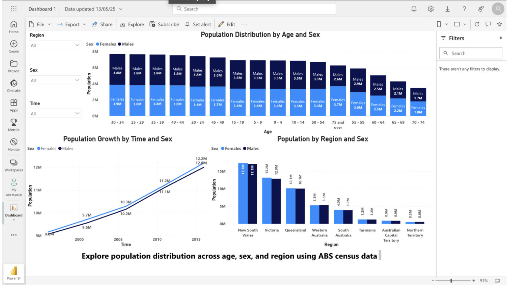
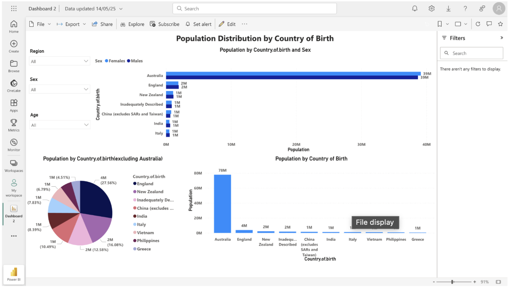
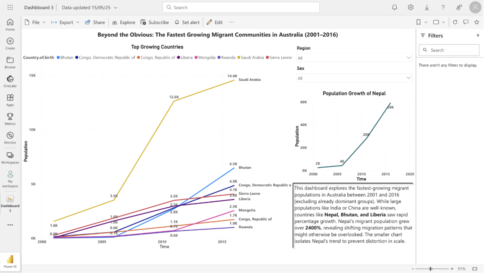

# Australian Population & Migration Trends Analysis

Analysis of 20 years of Australian Bureau of Statistics (ABS) census data from 1996 to 2016 across three Power BI dashboards covering national population growth, country-of-birth composition, and fast-growing migrant communities across Australian states and demographic groups.

**Key Result:** Nepal emerged as Australia's fastest-growing migrant community, increasing from 2,430 residents in 2001 to more than 59,000 in 2016 (+2,330%), highlighting demographic shifts that are often hidden behind larger migrant populations.

## Overview

This project analyses 20 years of Australian Bureau of Statistics (ABS) census data to understand how Australia's population evolved between 1996 and 2016. Three Power BI dashboards were developed to examine national population growth, migrant population composition, and emerging migrant communities that experienced rapid growth over time.

This project was completed as part of the Master of Business Analytics program at Macquarie University.

The analysis covers five census years: 1996, 2001, 2006, 2011, and 2016.

## Analytical Questions & Dashboards

**Dashboard 1 - National Population Overview**
Covers total population growth, state-level comparisons, gender distribution, and age group demographics from 1996 to 2016. Interactive slicers allow filtering by region, sex, and year.

**Dashboard 2 - Population by Country of Birth**
Explores the country-of-birth composition of Australian residents, showing migration diversity across gender and region. Top origin countries are visualised using clustered column, pie, and horizontal bar charts.

**Dashboard 3 - Fastest-Growing Migrant Communities**
Identifies countries with the highest percentage population growth from 2001 to 2016, excluding dominant groups. Nepal grew from 2,430 to more than 59,000 residents, representing 2,330% growth. Bhutan, Liberia, and Mongolia also showed strong relative growth.

## Key Findings

- Australia's population grew steadily from 1996 to 2016, with NSW and Victoria contributing the largest absolute increases.
- The population shows signs of ageing, with increased representation in the 50-74 age cohort.
- England, India, China, and New Zealand were among the largest migrant communities.
- Nepal was the fastest-growing migrant group in percentage terms, increasing 2,330% from 2001 to 2016.
- Bhutan, Liberia, and Mongolia also showed high relative growth.

## Dashboard Preview

### 1. National Population Overview

### 2. Population by Country of Birth

### 3. Fastest-Growing Migrant Communities

## Data & Methodology

### Data Sources
- Australian Bureau of Statistics (ABS) Census Data
- Census years: 1996, 2001, 2006, 2011 and 2016
- Population, age, gender and country-of-birth datasets

### Dataset Scope
- Five national census periods
- State-level and national demographic data
- Country-of-birth analysis across migrant communities
- Population growth calculations prepared in Excel and visualised in Power BI

### Data Preparation
- Cleaned and structured ABS demographic datasets across five census years
- Combined state, gender, age, and country-of-birth datasets into dashboard-ready tables
- Calculated population growth and percentage change metrics in Excel
- Built three linked Power BI dashboards progressing from national population trends to migration-specific insights
- Designed interactive filters for state, year, gender, age group, and country of birth

## Tech Stack

- Power BI Web
- Excel

## Skills Demonstrated

- Power BI dashboard development
- Demographic and population analysis
- Data cleaning and preparation
- Excel-based growth calculations
- Interactive dashboard design
- Data storytelling and insight communication

## Limitations

- Data covers 1996 to 2016 only, so post-2016 trends are not captured.
- Percentage growth calculations were prepared in Excel and integrated into the Power BI dashboards.
- Top country selections are static rather than dynamically updated by slicers.
- Age categories were grouped for clarity.

## Source Code & Files

- `Dashboard 1.pbix` - National Population Overview
- `Dashboard 2.pbix` - Population by Country of Birth
- `Dashboard 3.pbix` - Fastest-Growing Migrant Communities
- `Report.pdf` - Full project report with visualisations and findings