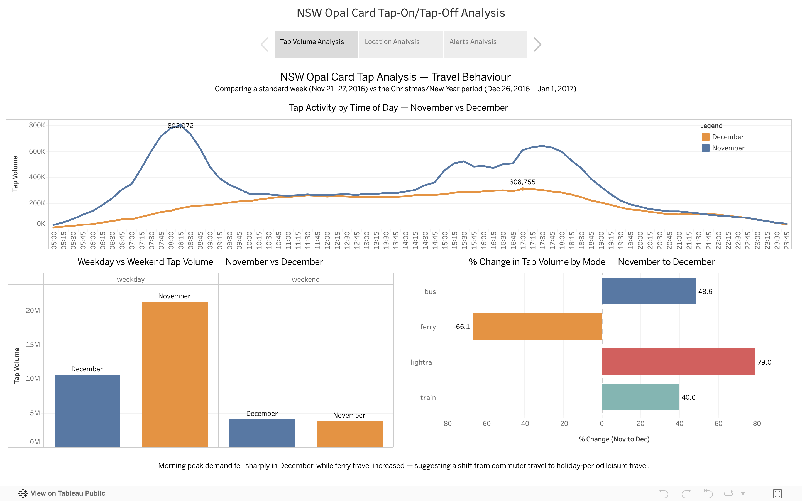
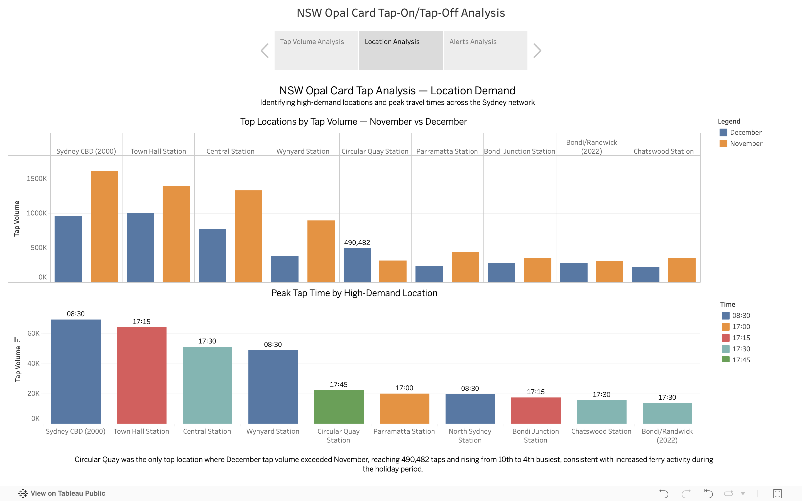
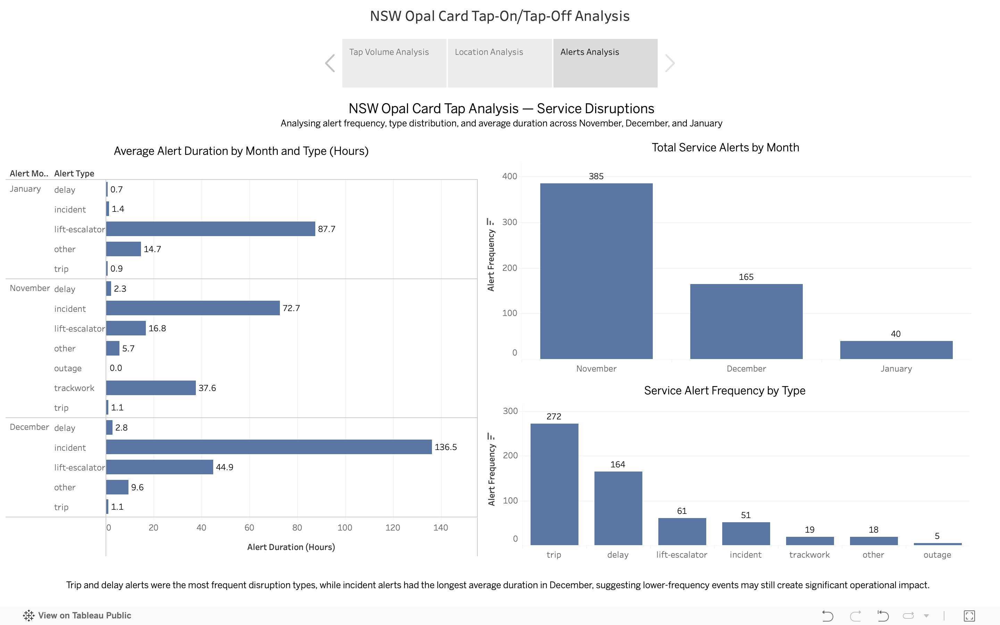

# NSW Opal Card Tap-On/Tap-Off Analysis

Exploratory analysis of real NSW Transport Opal card tap-on/tap-off data using PostgreSQL and Tableau, comparing travel behaviour between a standard November week and the Christmas/New Year period.

**Key Result:** Weekday travel demand fell by 50% during the Christmas/New Year period, while ferry usage increased and Circular Quay became one of the busiest locations in the network, indicating a shift from commuter travel to leisure-focused travel behaviour.

## Overview

An exploratory analysis of real Transport for NSW Opal card tap-on/tap-off data across two contrasting one-week periods: a standard November week (Nov 21-27, 2016) and the Christmas/New Year period (Dec 26, 2016 - Jan 1, 2017). The project uses PostgreSQL for data loading, cleaning, and analysis, and Tableau for visualisation across three dashboards.

The dataset comprises 398,019 rows across two travel files and a service alerts file, covering four transport modes: train, bus, ferry, and light rail.

## Data & Methodology

### Data Sources
- Transport for NSW Opal card tap-on/tap-off dataset
- Transport for NSW service alerts dataset
- November 21–27, 2016 travel period
- December 26, 2016 – January 1, 2017 travel period

### Data Preparation
- Loaded and validated 398,019 transport records in PostgreSQL
- Standardised inconsistent CSV formatting using Python preprocessing
- Removed invalid time values (-1) from time-based analysis
- Handled missing tap-direction values in the December dataset
- Combined travel and service-alert datasets for comparative analysis

### Dataset Scope
- 398,019 transport transactions
- Four transport modes: train, bus, ferry, and light rail
- Two contrasting one-week travel periods
- Service disruption and delay records

## Analytical Questions

1. When does peak demand occur, and does it differ by mode and day type?
2. How does travel behaviour shift between a standard week and the Christmas/New Year period?
3. What service disruption patterns emerge from the alerts data?
4. Which locations concentrate the most demand, and when do they peak?

## Key Findings

**Dashboard 1 — Travel Behaviour**

Morning peak demand fell sharply in December, while ferry travel increased, suggesting a shift from commuter travel to holiday-period leisure travel. Weekday travel dropped 50% while weekend travel held steady, compressing the weekday-to-weekend ratio from 5.6x in November to 2.6x in December.

**Dashboard 2 — Location Demand**

Circular Quay was the only top location where December tap volume exceeded November, reaching 490,482 taps and rising from 10th to 4th busiest location, consistent with increased ferry activity during the holiday period. Sydney CBD (postcode 2000) and Town Hall Station remained the highest-volume locations across both periods.

**Dashboard 3 — Service Disruptions**

Trip and delay alerts were the most frequent disruption types across all months. Incident alerts had the longest average duration in December at 136 hours, compared to 73 hours in November, suggesting lower-frequency events may still create significant operational impact. Trackwork alerts appeared only in November, consistent with maintenance activity pausing over the Christmas period.

## Dashboard Preview

### Dashboard 1 – Travel Behaviour

### Dashboard 2 – Location Demand

### Dashboard 3 – Service Disruptions

## Data Quality Notes

- The December dataset had 22,425 rows (~13%) missing the `tap` direction column. These rows were retained for volume analysis but excluded from any directional analysis. A Python CSV parser was used to standardise the file structure before loading.
- The `loc` column contains a mix of station names and postcodes, reflecting inconsistent source data formatting. Postcode aliases (e.g. 2000 = Sydney CBD) were applied in Tableau for readability.
- Time values of `-1` were present in both datasets and excluded from all time-based analysis.
- Late night time slots (00:00–04:45) show extreme percentage changes due to near-zero November volumes amplified by New Year's Eve activity. These are noted as data anomalies, not findings.

## Tech Stack

- PostgreSQL
- Tableau
- Python

## Source Code & Files

- [`SQL1_setup.sql`](./SQL1_setup.sql) - Table creation, CSV loading, and data preparation
- [`peak_demand_seasonal_shift.sql`](./peak_demand_seasonal_shift.sql) - Peak demand by time, mode, and day type
- [`disruption_analysis.sql`](./disruption_analysis.sql) - Alert frequency and duration analysis
- [`demand_concentration.sql`](./demand_concentration.sql) - Top locations and peak time per location

## Skills Demonstrated

- SQL data cleaning and transformation
- PostgreSQL querying, aggregation, and multi-table joins
- Common Table Expressions (CTEs)
- Window functions and analytical queries
- Tableau dashboard development
- Transport demand and disruption analysis
- Data storytelling and insight communication

## Limitations

- Each period covers only one week, so findings are illustrative, not statistically representative of broader seasonal trends
- Tap-on and tap-off records are separate rows, not paired journeys, so origin-destination analysis is not possible with this dataset
- The `loc` column's mixed format (station names vs postcodes) limits precise geographic analysis without an external lookup table
- Service alert duration outliers (e.g. incidents averaging 136 hours) may reflect unclosed alerts rather than actual disruption duration

## Live Dashboard

[View on Tableau Public](https://public.tableau.com/views/NSW_Opal_Card_Tap_Analysis/NSWOpalCardTap-OnTap-OffAnalysis)