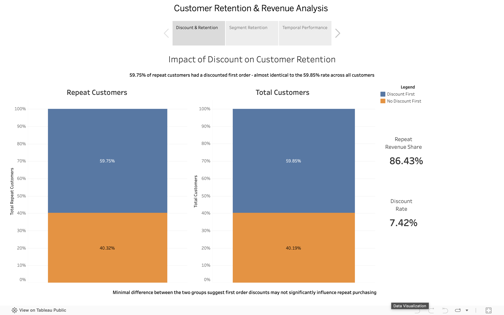
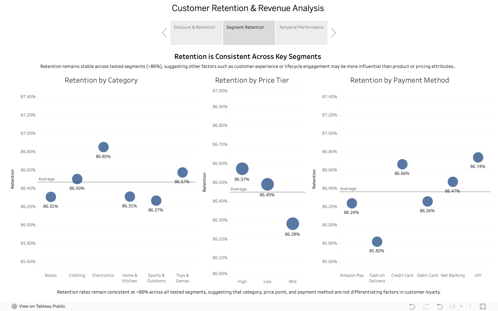
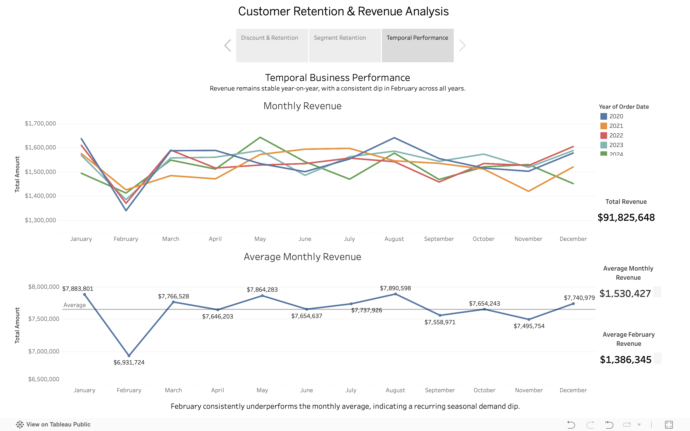

# Customer Retention & Revenue Analysis

Exploratory analysis of customer retention patterns and revenue trends across a 100,000-row synthetic Amazon e-commerce dataset using Tableau.

**Key Result:** Retention remained consistently high (~86%) across product categories, price tiers, and payment methods, while discounts showed no meaningful relationship with repeat purchasing behaviour.

## Overview

An exploratory analysis of a synthetic Amazon e-commerce dataset (100,000 rows, 20 columns) built across three Tableau dashboards. The project investigates customer retention patterns and examines revenue performance across five years (2020–2024).

## Data & Methodology

### Data Sources
- Synthetic Amazon e-commerce dataset
- 100,000 customer transaction records
- 20 variables covering orders, discounts, products, payments, and revenue

### Data Preparation
- Validated customer retention calculations across first and repeat purchases
- Created retention metrics by discount status, product category, price tier, and payment method
- Aggregated revenue trends across months and years
- Built three Tableau dashboards to answer specific business questions

### Dataset Scope
- Five-year period (2020–2024)
- Customer retention and purchasing behaviour
- Revenue performance and seasonality analysis

## Business Questions

1. Are discounts associated with repeat purchasing behaviour?
2. Does retention vary across product category, price tier, or payment method?
3. What does revenue performance look like over time, and are there notable patterns?

## Key Findings

**Dashboard 1 - Impact of Discount on Customer Retention**
59.75% of repeat customers had a discounted first order, almost identical to the 59.85% rate across all customers. Discounts do not appear to be associated with higher retention in this dataset.

**Dashboard 2 - Retention Across Key Segments**
Retention holds at ~86% regardless of product category, price tier, or payment method. No tested segment factor meaningfully differentiates retention rates.

**Dashboard 3 - Temporal Business Performance**
Total revenue of $91.8M is stable year-on-year. A consistent February revenue dip (~9.4% below monthly average) appears across all five years, suggesting a recurring seasonal demand pattern.

## Dashboard Preview

### Dashboard 1 – Impact of Discount on Customer Retention

### Dashboard 2 – Retention Across Key Segments

### Dashboard 3 – Temporal Business Performance

## Tech Stack

- Tableau

## Skills Demonstrated

- Tableau dashboard development
- Customer retention analysis
- Revenue and seasonality analysis
- Business-focused exploratory data analysis
- Segment comparison and performance evaluation
- Data storytelling and insight communication

## Limitations

- Findings are descriptive, not causal
- Factors outside the dataset (customer service, delivery experience) may better explain retention consistency
- Dataset is synthetic, so patterns may not reflect real Amazon behaviour

## Source Code & Files

- `CustomerRetentionRevenueAnalysis.twbx` - Tableau workbook with all three dashboards

## Live Dashboard

[View on Tableau Public](https://public.tableau.com/shared/2RJJMHJR9)
