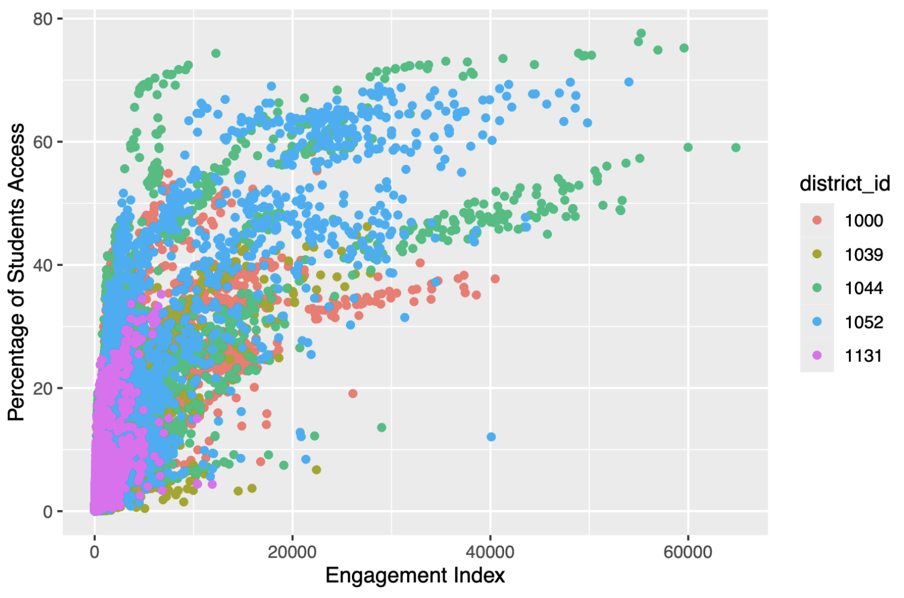
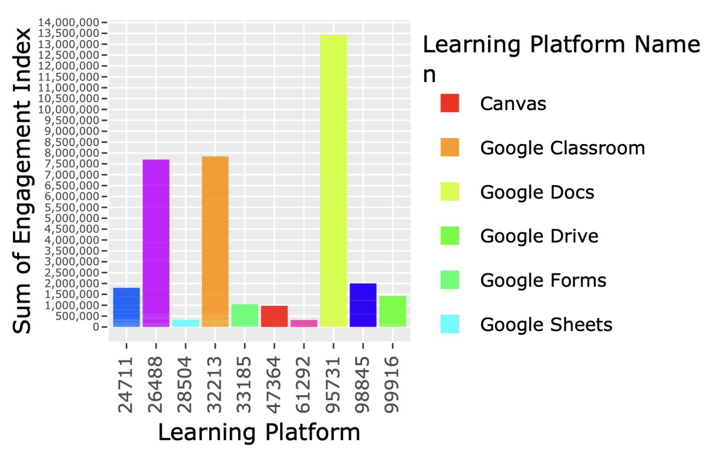

# COVID-19 Impact on Digital Learning

Analysis of student engagement, education platform usage, and broadband access data across five US school districts in 2020, using R to clean, integrate, and analyse multiple education datasets.

**Key Result:** Student engagement declined between June and August 2020 before recovering across all five districts. Districts with stronger broadband access consistently recorded higher engagement levels, while Learning & Curriculum platforms generated the highest overall usage.

## Overview

This project analyses engagement, education platform usage, and broadband access data from five school districts (IDs: 1000, 1039, 1044, 1052, 1131) across 2020 to examine patterns in online learning participation. The analysis covers data cleaning, exploratory visualisation, and findings across three analytical questions.

This project was completed as part of the Master of Business Analytics program at Macquarie University.

## Data & Methodology

### Data Sources
- LearnPlatform engagement dataset
- District demographic dataset
- Education product metadata dataset

### Data Preparation
- Standardised inconsistent state and locale labels
- Corrected date-format inconsistencies in engagement records
- Removed duplicate records and validated missing values
- Cleaned product metadata and category inconsistencies
- Merged district, engagement, and product datasets for analysis

### Dataset Scope
- Five US school districts
- 2020 calendar year
- Student engagement metrics
- Broadband access indicators
- Education platform usage data
- District 1044 contributed the largest data volume, while District 1131 provided the smallest sample

## Analytical Questions

1. What was the relationship between digital connectivity and student engagement in 2020?
2. How did engagement change during different phases of the COVID-19 pandemic?
3. Which types of education technology platforms showed the strongest engagement patterns?

## Key Findings

- A positive relationship was observed between broadband access and engagement index. Districts with higher broadband access showed higher student engagement in the dataset.
- Engagement and percentage access declined between June and August 2020, followed by a recovery phase across all five districts.
- Districts 1052 and 1000 exceeded pre-COVID engagement levels post-recovery, suggesting stronger digital learning uptake in those districts. District 1039 did not fully recover, indicating possible ongoing access or engagement challenges.
- Google Docs was the highest-engagement learning platform across all districts. Learning & Curriculum platforms dominated overall engagement, consistent with the majority of available tools being categorised as Learning & Curriculum.

## Visualisation Preview

### Engagement Index Growth in 2020

### Top 10 Learning Platforms by Engagement

## Tech Stack

- R
- tidyverse
- ggplot2
- Plotly

## Skills Demonstrated

- R-based exploratory data analysis
- Data cleaning and preparation
- ggplot2 and Plotly visualisation
- Correlation and trend analysis
- Multi-dataset integration and transformation
- Data storytelling and insight communication

## Source Code & Files

- `covid-digital-learning-analysis.Rmd` - R Markdown file with full analysis and code
- `Report.pdf` - Submitted report with visualisations and findings

## Limitations

- Analysis is based on five school districts and may not represent broader education trends across the United States
- The dataset covers 2020 only and does not capture post-pandemic learning behaviour
- Some engagement and percentage-access trends may be influenced by district-specific reporting practices
- Interactive Plotly visualisations used in the original analysis are not fully represented in the static report outputs
- Findings are exploratory and identify relationships rather than causal effects