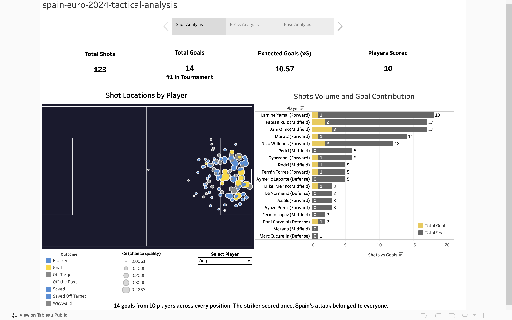
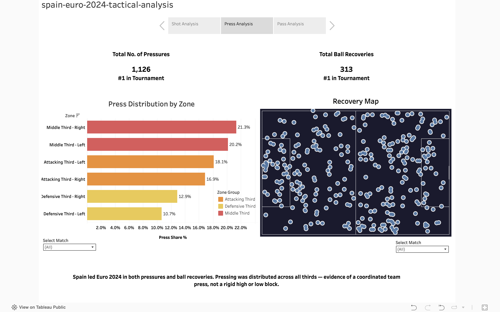
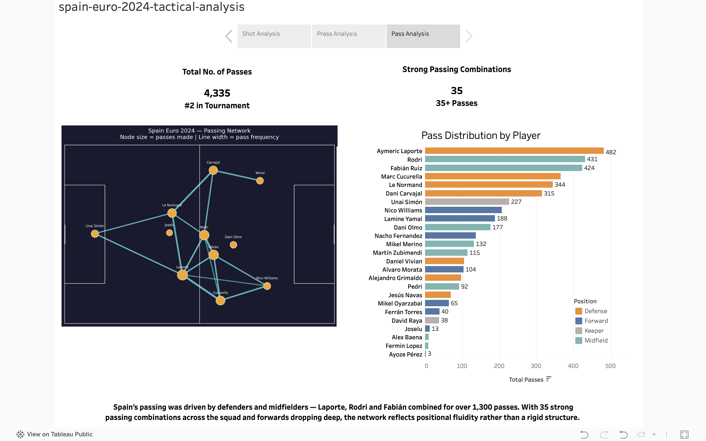

# Spain at Euro 2024 — A Tactical Analysis

An analytical breakdown of Spain's UEFA Euro 2024 campaign using StatsBomb open event data. The project uses Python for data collection, transformation, and analysis, and Tableau for interactive dashboard development.

**Key Result:** Spain ranked #1 at Euro 2024 for goals, pressures, and recoveries, while generating goals from 10 different scorers and maintaining a possession structure centred on defenders and midfielders rather than a traditional striker.

## Overview

Spain won UEFA Euro 2024 undefeated across seven matches, playing a fluid, press-heavy style without relying on a traditional striker. This project analyses their campaign across three tactical dimensions: attacking threat creation, defensive pressing, and passing network structure.

The dataset covers all seven Spain matches (group stage through final) using StatsBomb open data, accessed via raw HTTP requests. Tournament-wide rankings were computed across all 51 Euro 2024 matches to benchmark Spain against every team in the competition.

## Analytical Questions

1. Where did Spain's shots originate, and which players arrived in goal-scoring positions?
2. How high did Spain press, and where did they win the ball back?
3. How distributed was Spain's passing network, and what does it reveal about Spain's positional structure?

## Data & Methodology

**Data source:** StatsBomb open event data, accessed via raw HTTP GET requests to their public GitHub repository. No wrapper library was used. All data was fetched, parsed, and processed directly from JSON.

**Raw data structure:** Each match file contains approximately 3,000–3,500 events as a list of JSON dictionaries. Events record the action type, team, player, pitch coordinates (0–120 × 0–80 scale), timestamp, and action-specific attributes such as xG, pass recipient, pass length, and shot outcome.

### Pipeline

- `01_fetch_data.py` retrieves and validates raw event JSON for a single match
- `02_explore_events.py` explores event types, fields, and location availability across the dataset
- `03_shots_analysis.py` extracts shot events, xG values, outcomes, and locations across all seven Spain matches
- `04_press_analysis.py` analyses pressure events, recovery locations, and pressing zones
- `05_pass_analysis.py` builds player passing networks, average positions, and connection strengths
- `06_tournament_rankings.py` aggregates all 51 Euro 2024 matches to benchmark Spain against every team in the tournament

### Key Decisions

- Passes without a recorded recipient were excluded from the passing network (primarily incomplete passes and clearances logged as passes)
- Passing connections were filtered to 35+ passes to highlight meaningful structural relationships
- Press zones were defined using six pitch regions (Defensive, Middle, Attacking × Left, Right)
- Own goals do not appear as shot events in StatsBomb data and therefore do not contribute to Spain's recorded shot totals

## Key Findings

### Shot Creation

Spain generated 123 shots across seven matches and ranked #1 in goals scored with 14 StatsBomb-attributed goals from 10 different scorers. Goals came from defenders, midfielders, wingers, and substitutes. The centre forward (Morata) scored once. Shot locations show attacking threat distributed across the squad rather than concentrated through a single striker. Spain scored 14 goals from 10.57 xG, indicating finishing above expectation.

### Pressing

Spain led Euro 2024 with 1,126 pressures and 313 ball recoveries, ranking #1 in both categories. The median pressure location was x = 67.2 on StatsBomb's 0–120 pitch scale, placing the average press just beyond the halfway line. Seventy-six percent of pressures occurred in the middle and attacking thirds, indicating a coordinated team press rather than a passive defensive block.

### Passing Network

The centre forward was not a central passing node. Spain completed 4,335 passes across the tournament, ranking second only to England. The passing network was dominated by a defensive and central midfield spine: Laporte (482), Rodri (431), Fabián Ruiz (424), Cucurella (365), and Le Normand (344) were the five highest-volume passers. Thirty-five strong passing combinations (35+ passes between a pair) were identified. Yamal and Nico Williams appeared as peripheral nodes, receiving possession in advanced areas rather than participating heavily in build-up circulation.

## Project Structure

- [`01_fetch_data.py`](./scripts/01_fetch_data.py) — Fetch and validate raw event JSON for a single match
- [`02_explore_events.py`](./scripts/02_explore_events.py) — Inspect event types, fields, and data structure
- [`03_shots_analysis.py`](./scripts/03_shots_analysis.py) — Shot locations, xG, outcomes, and goal-scoring positions
- [`04_press_analysis.py`](./scripts/04_press_analysis.py) — Press height, zone distribution, and recovery locations
- [`05_pass_analysis.py`](./scripts/05_pass_analysis.py) — Passing network structure, player positions, and connection strength
- [`06_tournament_rankings.py`](./scripts/06_tournament_rankings.py) — Tournament-wide aggregation and benchmarking

## Tech Stack

- Python
- pandas
- Matplotlib
- StatsBomb Open Data
- Tableau

## Skills Demonstrated

- API data collection and JSON processing
- Data cleaning and transformation using pandas
- Exploratory event data analysis
- Statistical analysis and benchmarking
- Spatial sports analytics
- Network analysis
- Dashboard design and data storytelling

## Limitations

- StatsBomb event data records 14 goals for Spain. The official UEFA total is 15 because one goal was an own goal (Calafiori vs Italy), which does not appear as a Spain shot event
- Passing network analysis filters to connections of 35+ passes and excludes lower-volume relationships
- Press analysis uses raw pressure locations and does not account for scoreline, opposition quality, or match state
- Average player positions are calculated across the full tournament and may mask match-to-match variation
- StatsBomb 360 freeze-frame data was available but not incorporated into this analysis

## Dashboard Preview

### Shot Analysis

### Press Analysis

### Pass Analysis

## Interactive Dashboard

[View on Tableau Public](https://public.tableau.com/views/spain-euro-2024-tactical-analysis/spain-euro-2024-tactical-analysis)